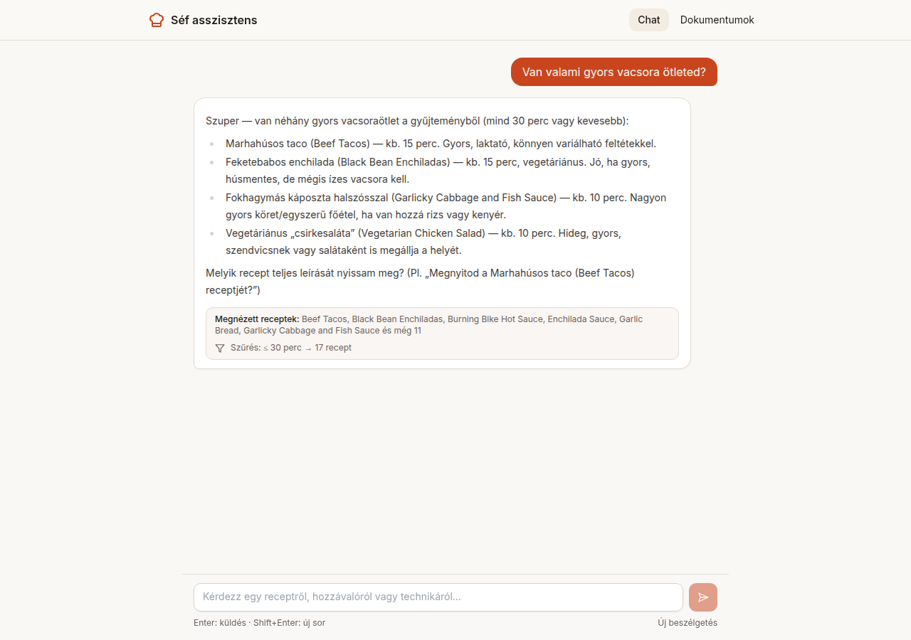
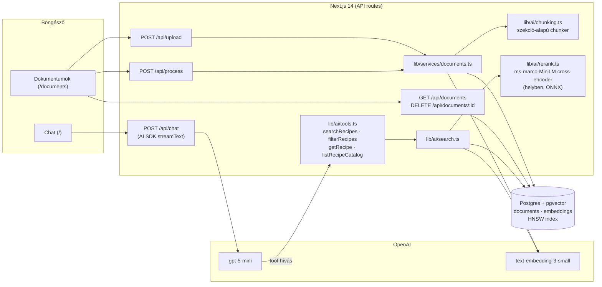

# Séf asszisztens – receptes RAG webapp

A 3. modul házi feladata ([feladatleírás](docs/hw3/ASSIGNMENT.md)): egy webes AI asszisztens, amely
[Jeff Thompson receptgyűjteményéből](https://github.com/jeffThompson/Recipes) (85 angol recept) és a
felhasználó által feltöltött dokumentumokból válaszol, **magyarul**. A hw2 Jupyter notebookos RAG
prototípusának ([`docs/hw2`](docs/hw2/hw2_rag_notebook.ipynb)) webalkalmazássá alakított változata,
a [Vercel AI SDK RAG starter](https://github.com/fuszti/ai-sdk-rag-starter) alapján.



**Mit tud**

- Chat magyarul, a receptgyűjtemény alapján; ha valami nincs a gyűjteményben (pl. carbonara,
  desszert), ezt kimondja, és létező, hasonló receptet ajánl – kitalált recept nélkül.
- Minden válasz alatt látszik, mely receptek jöttek ténylegesen a keresésből.
- Dokumentumfeltöltés (`.md`, `.txt`) drag & droppal: szekció-alapú chunkolás, OpenAI embedding,
  pgvector. Lista, újrafeldolgozás, törlés.
- Keresés cross-encoder **rerankinggel**, metaadat-szűrés (vegetáriánus, elkészítési idő,
  nehézség), mobilon is használható felület.
- Futtatható mérőscriptek: keresési pontosság, válaszidő, system prompt A/B, skálázás.

## Tartalom

1. [Indítás Dockerrel](#indítás-dockerrel)
2. [Fejlesztői futtatás](#fejlesztői-futtatás)
3. [Architektúra](#architektúra)
4. [API dokumentáció](#api-dokumentáció)
5. [Chunking](#chunking)
6. [Keresés és toolok](#keresés-és-toolok)
7. [System prompt](#system-prompt)
8. [Tesztelés és eredmények](#tesztelés-és-eredmények)
9. [Tanulságok, korlátok, fejlesztési lehetőségek](#tanulságok-korlátok-fejlesztési-lehetőségek)

## Indítás Dockerrel

Kell hozzá: Docker (Compose v2) és egy OpenAI API kulcs.

```bash
git clone https://github.com/mangalaci/chef-assistant.git
cd chef-assistant
cp .env.example .env              # majd írd be az OPENAI_API_KEY értékét
docker compose up -d --build      # adatbázis + webapp; a webapp induláskor migrál
docker compose exec web pnpm seed # a 85 recept betöltése (~25 mp, ~$0,0007)
```

Ezután: <http://localhost:3000> (chat) és <http://localhost:3000/documents> (dokumentumok).

A `web` image a build során letölti a reranker modellt (~23 MB a Hugging Face-ről), így futás
közben már nem kell hozzá internet – csak az OpenAI API.

## Fejlesztői futtatás

Node.js 20+ és pnpm (`corepack enable`) kell hozzá.

```bash
cp .env.example .env          # OPENAI_API_KEY kitöltése
docker compose up -d postgres # csak az adatbázis
pnpm install
pnpm db:migrate
pnpm dev                      # http://localhost:3000
pnpm seed                     # másik terminálban, amíg a dev szerver fut
```

**Környezeti változók** (`.env`, minta: [`.env.example`](.env.example))

| változó | kötelező | alapérték | leírás |
|---|---|---|---|
| `DATABASE_URL` | igen | – | Postgres + pgvector kapcsolat |
| `OPENAI_API_KEY` | igen | – | embedding és chat |
| `CHAT_MODEL` | nem | `gpt-5-mini` | a chat modell; `gpt-5` jobb, de kb. kétszer lassabb |
| `REASONING_EFFORT` | nem | `low` | a gpt-5* modellek gondolkodási ideje: `minimal`, `low`, `medium`, `high` |

**Hasznos parancsok**

| parancs | mit csinál |
|---|---|
| `pnpm seed` | `data/recipes` feltöltése és feldolgozása az app saját API-ján keresztül |
| `pnpm ask "kérdés"` | kérdés a futó chatnek; kiírja a tool-hívásokat, a választ és az időket |
| `pnpm chunk:preview` | a chunker statisztikája a 85 recepten (DB és OpenAI nélkül) |
| `pnpm test:retrieval` / `test:latency` / `test:prompts` / `test:scale` | mérések, lásd [Tesztelés](#tesztelés-és-eredmények) |
| `pnpm db:studio` | adatbázis-böngésző (Drizzle Studio) |

## Architektúra



A kurzus [magas szintű architektúra-ábrájából](docs/hw3/high_level_architecture.jpg) ez a projekt a
frontend → public API → vektoradatbázis → LLM részt valósítja meg; a monitoring és az eval rész a
későbbi modulok témája.

**Adatmodell** ([`lib/db/schema`](lib/db/schema))

- `documents`: fájlnév (egyedi), MIME típus, méret, a teljes szöveg, állapot
  (`uploaded` → `processing` → `processed` / `failed`), chunkszám, hibaüzenet, időpontok.
  A szöveg megmarad, ezért a feldolgozás bármikor újrafuttatható.
- `embeddings`: egy sor = egy chunk. `document_id` idegen kulcs **ON DELETE CASCADE**-del;
  szűrhető oszlopok (`recipe_name`, `section_type`, `category`, `difficulty`), a többi metaadat
  `jsonb`-ben; `vector(1536)` **HNSW** (cosine) indexszel.

**Könyvtárszerkezet**

```
app/                  oldalak és API route-ok
components/chat/      chat UI (üzenet, javasolt kérdések, forrás-nyom)
components/documents/ feltöltés, dokumentumlista
lib/ai/               chunking, embedding, keresés, reranking, toolok, system prompt
lib/services/         dokumentumkezelés üzleti logikája (a route-ok és a seed is ezt hívja)
lib/db/               Drizzle séma és migrációk
scripts/              seed, ask, mérőscriptek
data/recipes/         a 85 recept (MIT licenc, lásd data/README.md)
docs/                 feladatleírás, hw2 notebook, terv, mérési eredmények, képernyőképek
```

## API dokumentáció

Minden végpont JSON-t ad ugyanabban a formában (a lenti válaszok valódi futásokból valók, a lista rövidítve):

```jsonc
{ "ok": true, "data": { ... } }
{ "ok": false, "error": { "code": "VALIDATION_FAILED", "message": "…", "details": … } }
```

| HTTP | `code` | mikor |
|---|---|---|
| 400 | `BAD_REQUEST` | nem multipart kérés, nincs fájl, túl sok fájl, hibás JSON |
| 400 | `VALIDATION_FAILED` | rossz paraméter (pl. ismeretlen `status`, `documentIds` nem tömb) |
| 404 | `NOT_FOUND` | nincs ilyen dokumentum |
| 422 | `VALIDATION_FAILED` | feltöltésnél egyik fájl sem érvényes (`details`: fájlonkénti ok) |
| 500 | `INTERNAL_ERROR` | szerverhiba (a részletek csak a szerver logjában) |

### `POST /api/upload`

`multipart/form-data`, egy vagy több fájl a `files` mezőben (legfeljebb 50). Csak elment,
`uploaded` állapotban; az embedding a `/api/process` dolga.

Ellenőrzés: `.md` vagy `.txt` kiterjesztés; MIME típus `text/markdown`, `text/plain`, vagy üres /
`application/octet-stream` (a böngészők `.md`-nél gyakran ezt küldik – ilyenkor a kiterjesztés dönt);
legfeljebb 1 MB; érvényes UTF-8; nem üres. A fájlnévből csak az alapnév marad (`../../x.md` → `x.md`).
Ugyanilyen nevű fájl felülíródik (`replaced`), a régi chunkjai törlődnek.

```bash
curl -F "files=@data/recipes/beef-tacos.md" -F "files=@notes.pdf" http://localhost:3000/api/upload
```

```json
{ "ok": true, "data": {
  "results": [
    { "filename": "beef-tacos.md", "id": "31pvhfltrjmhillrc9q5v", "status": "replaced", "sizeBytes": 564 },
    { "filename": "notes.pdf", "status": "rejected", "error": "Nem támogatott fájltípus (.pdf). Csak .md és .txt." }
  ],
  "accepted": 1, "rejected": 1 } }
```

### `POST /api/process`

Törzs: `{ "documentIds"?: string[] }` (1–100 azonosító). Üres törzzsel az összes `uploaded` vagy
`failed` dokumentumot feldolgozza. Dokumentumonként: chunkolás → embedding 96-os csomagokban
(újrapróbálással) → a régi chunkok cseréje egy tranzakcióban. Egy hibás dokumentum `failed` lesz a
hibaüzenettel, a többi feldolgozása folytatódik.

```bash
curl -X POST http://localhost:3000/api/process \
  -H 'content-type: application/json' -d '{"documentIds":["31pvhfltrjmhillrc9q5v"]}'
```

```json
{ "ok": true, "data": {
  "results": [ { "id": "31pvhfltrjmhillrc9q5v", "filename": "beef-tacos.md", "status": "processed",
                 "chunkCount": 2, "tokens": 152, "ms": 1209 } ],
  "notFound": [], "processed": 1, "failed": 0, "chunks": 2, "tokens": 152, "ms": 1228 } }
```

### `GET /api/documents`

Dokumentumlista, a legújabb elöl, a szöveg nélkül. Opcionális szűrő: `?status=uploaded|processing|processed|failed`.

```bash
curl "http://localhost:3000/api/documents"
```

```json
{ "ok": true, "data": { "documents": [
  { "id": "31pvhfltrjmhillrc9q5v", "filename": "beef-tacos.md", "mimeType": "text/markdown", "sizeBytes": 564,
    "status": "processed", "chunkCount": 2, "errorMessage": null,
    "createdAt": "2026-10-06T20:56:14.736Z", "processedAt": "2026-10-06T20:56:16.541Z" },
  … ],
  "count": 85 } }
```

### `DELETE /api/documents/:id`

Törli a dokumentumot; a chunkjai az idegen kulcs (`ON DELETE CASCADE`) miatt vele törlődnek.

```bash
curl -X DELETE http://localhost:3000/api/documents/31pvhfltrjmhillrc9q5v
```

```json
{ "ok": true, "data": { "deleted": { "id": "31pvhfltrjmhillrc9q5v", "filename": "beef-tacos.md", "chunkCount": 2 } } }
```

### `POST /api/chat`

A Vercel AI SDK chat végpontja (`useChat`): `{ messages: UIMessage[] }`, a válasz UI message
stream (server-sent events), benne a szöveg és a tool-hívások. Parancssorból: `pnpm ask "kérdés"`.

## Chunking

[`lib/ai/chunking.ts`](lib/ai/chunking.ts) – a hw2 „B” (szekció-alapú) stratégiája TypeScriptben,
az ott talált hibák javításával. Struktúra nélküli szövegre (`.txt`) a hw2 „C” stratégiája a
tartalék: 500 karakteres darabok 100 karakter átfedéssel, szóhatáron vágva.

1. **Normalizálás:** CRLF → LF, sorvégi szóközök, és a fejlécek egységesítése: 6 receptben
   kettőspont van a fejléc végén (`## notes:`), ezek a hw2-ben `other` címkét kaptak.
2. **Egy chunk = egy szekció** (`ingredients`, `steps`, `notes`). Az 1200 karakternél hosszabb
   szekciók listaelem-határon ~800 karakteres darabokra vágódnak, egy elem átfedéssel.
3. **Kontextus minden chunkban:** a fejléc a recept neve, az alcíme (22 receptben van), az idő és
   az adag, pl. `Beef Tacos — ingredients` / `About 15 minutes · 2 servings`.
4. **Nem lesz külön chunk** a címből (a hw2-ben 93 ilyen zaj-chunk volt, a legrövidebb 4 karakter),
   az `info`-ból és a `based on`-ból: ezek a fejlécbe, illetve a metaadatba (`sources`) kerülnek.
5. **Metaadatok:** a hw2 logikájával a hozzávalók és lépések száma, az elkészítési idő
   (`prepMinutes`), a nehézség (≤3 lépés könnyű, ≤7 közepes) és a kategória (a hw2
   fájlnév-szabályai); újként az adag, a `vegetarian` jelző (hús/hal kulcsszavak a hozzávalókban) és
   a forráslinkek.

| | hw2, B stratégia | chef-assistant |
|---|---|---|
| chunk | 442 | 254 |
| legrövidebb / átlag / leghosszabb | 4 / 269 / 2967 karakter | 52 / 487 / 1266 karakter |
| `other` (zaj) chunk | 93 | 0 |

`pnpm chunk:preview` kiírja ezt a táblát, és ellenőrzi, hogy nincs 50 karakternél rövidebb chunk,
minden chunk a recept nevével kezdődik, és nem maradt kettőspontos fejléc.

## Keresés és toolok

[`lib/ai/search.ts`](lib/ai/search.ts): a kérdés embeddingje → a 20 legközelebbi chunk (HNSW) →
0,3 alatti hasonlóság kiszűrése → **cross-encoder reranking**
([`Xenova/ms-marco-MiniLM-L-6-v2`](https://huggingface.co/Xenova/ms-marco-MiniLM-L-6-v2), ugyanaz a
modell, mint a hw2-ben, helyben futtatva) → receptenként legfeljebb 2 chunk → 6 találat. Ha a reranker
nem tölthető be, a keresés a vektoros sorrenddel működik tovább.

A chat modell négy toolt kap ([`lib/ai/tools.ts`](lib/ai/tools.ts)):

| tool | mire |
|---|---|
| `searchRecipes` | szemantikus keresés **angol** lekérdezéssel (a modell fordít), opcionális szűrőkkel |
| `filterRecipes` | csak metaadat (vegetáriánus, kategória, nehézség, max. idő) – pl. „gyors vacsora” |
| `getRecipe` | egy teljes recept, mielőtt mennyiségeket vagy lépéseket ír |
| `listRecipeCatalog` | az összes receptnév – ellenőrzés, mielőtt azt mondja, valami nincs |

## System prompt

A teljes szöveg: [`lib/ai/prompts.ts`](lib/ai/prompts.ts). Felépítése:

- **Szerep és adatforrás:** szakértő, barátságos séf asszisztens; a gyűjteményben nincs desszert és
  olasz tészta – ezt a modell előre tudja.
- **Feladatok** a feladatkiírás szerint: receptkeresés, hozzávalók alapján ajánlás, technikák,
  helyettesítő alapanyagok.
- **Toolhasználat:** keresés angolul; szűrőt csak kérésre; „gyors” = elkészítési idő szerinti
  szűrés; a `category` megbízhatatlan, ételtípusnál a modell maga válogat.
- **Anti-hallucináció:** recept, hozzávaló, mennyiség és lépés csak tool-kimenetből; a keresés mindig
  ad vissza valamit, ezért a modellnek meg kell ítélnie, releváns-e; ha nincs releváns recept, ezt
  egyszer kimondja, és 1–3 létező, hasonló receptet ajánl.
- **Általános tudás, jelölve:** technikát és helyettesítést elmagyarázhat „(általános konyhai tudás,
  nem a gyűjteményből)” jelöléssel; gyűjteményen kívüli ételhez legfeljebb 3–5 soros áttekintést ad,
  teljes receptet nem ír, és nem is ajánl fel.
- **Stílus:** magyarul, tegezve, tömören; a recept neve magyarul, zárójelben az eredeti angol névvel
  (így a válasz visszakereshető, és a felület ebből jelzi a forrásokat).

A prompt a tesztek alapján több körben szigorodott; a hibák és javításaik a
[tervben](docs/PLAN.md) vannak felsorolva (pl. a modell kéretlen szűrőket adott a kereséshez, és
0 találatot kapott).

## Tesztelés és eredmények

Minden mérés futtatható script, a kimenete Markdown; a teljes eredmények: [`docs/results/`](docs/results).

### Az 5 kötelező tesztkérdés

Mind az 5-re kitalált recept nélkül válaszol (teljes válaszok:
[`phase5-test-questions.md`](docs/results/phase5-test-questions.md)):

| kérdés | mit csinál a rendszer |
|---|---|
| Milyen édességet tudok csinálni csokival? | nincs desszert a gyűjteményben – kimondja; megemlíti az egyetlen valódi kapcsolódást (mexikói csoki az *Enchilada Sauce*-ban) |
| Mit főzhetek, ha van otthon csirkemellfilém? | *Chicken Schnitzel* (az egyetlen valódi csirkemelles recept) elöl, mellette csirkés receptek, jelezve, ha combbal készülnek |
| Van valami gyors vacsora ötleted? | ≤30 perces szűrés: *Beef Tacos*, *Black Bean Enchiladas*, *Garlicky Cabbage and Fish Sauce*, idővel |
| Hogyan készítsek carbonarát? | nincs a gyűjteményben – kimondja; rövid, jelölt áttekintés; *Homemade Pasta*, *Mac and Cheese* ajánlás |
| Milyen vegetáriánus főételeket ajánlasz? | 8 valódi főétel (*Channa Masala*, *Tarka Dal*, *Phat Phrik Khing*, …), szószok nélkül |

### Keresési pontosság – `pnpm test:retrieval`

12 saját tesztkérdés, mindegyikhez a hozzávalólisták alapján ellenőrzött releváns receptekkel
([`scripts/eval/cases.ts`](scripts/eval/cases.ts)); receptszintű mérés. Részletek: [`retrieval.md`](docs/results/retrieval.md).

| konfiguráció | Hit@1 | Recall@5 | MRR |
|---|---|---|---|
| angol lekérdezés, vektor | 0,58 | 0,79 | 0,77 |
| **angol lekérdezés, vektor + rerank** | **0,75** | **0,79** | **0,85** |
| magyar lekérdezés, vektor | 0,08 | 0,18 | 0,20 |
| magyar lekérdezés, vektor + rerank | 0,25 | 0,22 | 0,34 |

- A **reranking** 12 esetből 2 további esetben hozza az első helyre a jó receptet (Hit@1: 7 → 9),
  kb. +0,5–1 mp keresésenként.
- **Magyar kérdéssel** a keresés használhatatlan az angol korpuszon – ezért a modell angolul keres.
- **Chunking A/B:** a starter `split(".")` darabolása (1331 chunk, a legrövidebb 2 karakter) nyers
  vektoros rangsorban jobb (MRR 0,88), de a legjobb chunkjai közül **egyik sem nevezi meg a
  receptet** (pl. „Add 1”), és rerankinggel romlik (0,82). A szekció-alapú darabolás rerankinggel
  0,85, és minden chunk tartalmazza a recept nevét – a modell ebből tud válaszolni.
- **Negatív esetek** (csoki, carbonara, sushi): a legjobb hasonlóság 0,43, a leggyengébb pozitívé
  0,44. Ekkora különbségre nem lehet küszöböt építeni, ezért a relevanciáról a modell dönt.

### Válaszidő – `pnpm test:latency`

`/api/chat`, production build, az 5 kérdés × 3 futás ([`latency.md`](docs/results/latency.md)):

| modell | első token (átlag) | teljes válasz min / átlag / max |
|---|---|---|
| **gpt-5-mini** (alapérték) | 4,2 mp | 4,9 / 7,2 / 11,1 mp |
| gpt-5 | 10,2 mp | 9,6 / 15,6 / 31,0 mp |

A modell „gondolkodási ideje” a legnagyobb tényező: ugyanarra a kérdésre `reasoningEffort` medium
26,7 mp, low 9,1 mp, minimal 6,0 mp volt, hasonló minőséggel – ezért `low` az alapérték.

### System prompt hatása – `pnpm test:prompts`

Ugyanaz a modell és ugyanazok a toolok, csak a prompt más ([`prompt-ab.md`](docs/results/prompt-ab.md)):

| | starter prompt (angol) | séf prompt (magyar) |
|---|---|---|
| csoki / carbonara | „Sorry, I don't know.” – angolul, alternatíva nélkül | magyarul kimondja, hogy nincs; 1–3 valódi alternatíva; jelölt általános tudás |
| vegetáriánus főételek | 4 recept, köztük egy szósz (*Enchilada Sauce*) | 7–8 valódi főétel |
| nyelv | a „nincs találat” válaszok angolok | mindig magyar |

### Nagyobb adathalmaz, memória – `pnpm test:scale`

A 254 valódi chunk-vektor mellé szintetikus vektorok (két valódi vektor keveréke) egy ideiglenes
táblában, ugyanazzal a HNSW indexszel ([`scale.md`](docs/results/scale.md)):

| chunk | tábla + index | pontos keresés (átl.) | HNSW keresés (átl.) | HNSW egyezés a pontos top 20-szal |
|---|---|---|---|---|
| 254 | 4,1 MB | 4,5 ms | 4,1 ms | 100% |
| 2 540 | 40,2 MB | 13,3 ms | 3,3 ms | 100% |
| 10 160 | 160,5 MB | 53,0 ms | 4,2 ms | 96% (ef_search=100: 99%) |

Memória: a Next.js szerver a betöltött rerankerrel kb. **800 MB** RAM; ebből a reranker modell kb.
350 MB. A teljes 85 receptes betöltés 22,7 mp, 34 196 embedding token (≈ $0,0007).

## Tanulságok, korlátok, fejlesztési lehetőségek

**Tanulságok**

- **A „nincs ilyen recept” a legnehezebb eset.** A vektorkeresés mindig ad találatot, és a
  hasonlóság nem választja el tisztán a releváns és az irreleváns találatot. Ezt nem küszöb oldja
  meg, hanem a prompt: a modell ítéli meg a relevanciát, és alternatívát ajánl.
- **Nyelv:** magyar kérdés + angol korpusz mellett a keresési lekérdezést angolul kell
  megfogalmazni (MRR 0,20 → 0,77); a modell ezt jól elvégzi.
- **A chunking-mérőszám félrevezethet:** sok apró chunk jobb rangsort adhat, miközben a modellnek
  használhatatlan kontextust ad. A chunknak önmagában értelmesnek kell lennie (recept neve benne).
- **A reranking hasznos, de nem csodaszer:** egyértelmű kérdéseknél javít, néha egy-egy szóra
  „ráugrik” (a „vegetarian curry” keresésnél a nevében „Vegetarian” receptet hozza előre).
- **A promptot mérni kell, nem csak megírni:** több hibát (szósz főételként, kéretlen szűrők,
  felajánlott „általános” teljes recept) csak a tesztfutások hoztak elő.
- **A tesztadat is lehet hibás:** az első skálázási tesztben 40 majdnem azonos másolat szoros
  klasztereket alkotott, és a HNSW csak a találatok 53–86%-át hozta – ez a tesztadat hibája volt,
  nem az indexé.
- **Apró technikai csapdák:** a Drizzle 0.31 `jsonb()` oszlopa postgres.js-sel szövegként mentette a
  metaadatot (saját oszloptípussal javítva); a `gpt-5` reasoning modell alapbeállítással lassú.

**Korlátok**

- A `category` (hw2 fájlnév-szabályok) és a `vegetarian` jelző heurisztika; a `vegetarian`
  szigorú (pl. a csirkealaplés *Sesame Tofu* kiesik).
- Elkészítési idő csak 40 receptnél van, a „gyors” szűrés a többit nem látja.
- A feltöltött dokumentumokhoz nincs felhasználókezelés; mindenki ugyanazt a gyűjteményt látja.
- A Docker image kb. 1,8 GB (Next.js fordítók, ONNX runtime, devDependency-k a migrációhoz).
- A chat beszélgetések nem mentődnek.

**Fejlesztési lehetőségek**

- LLM-alapú kategorizálás és vegetáriánus-besorolás feltöltéskor a heurisztikák helyett.
- Hibrid keresés (BM25 + vektor) a kulcsszavas kérdésekhez (pl. hozzávalónevek).
- Többnyelvű reranker vagy a recept magyar fordításának tárolása.
- Válasz-szintű automatikus értékelés (LLM-judge: hűség a forráshoz, relevancia), és
  felhasználói visszajelzés gomb – a kurzus következő moduljainak témái.
- Kisebb Docker image (`next build` standalone kimenet, migrációk build-elt JS-ként).

## Források és licenc

- Receptek: [Jeff Thompson: Recipes](https://github.com/jeffThompson/Recipes), MIT licenc – lásd
  [`data/README.md`](data/README.md).
- Kiinduló kód: [fuszti/ai-sdk-rag-starter](https://github.com/fuszti/ai-sdk-rag-starter)
  (Vercel AI SDK RAG guide).
- A megvalósítás fázisai és döntései: [`docs/PLAN.md`](docs/PLAN.md).
